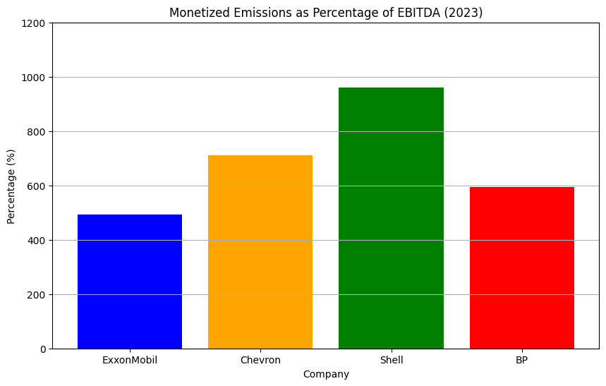
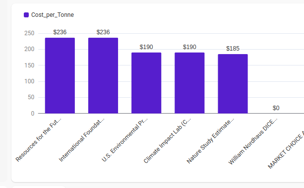

# Monetised Emissions Over EBITDA:  Example Findings

Data: Initial
Date: 03-Nov-2024

While many companies are making progress in reducing their greenhouse gas emissions, the oil and gas sector is an example of an industry in which the sheer scale of the emissions is so large that in spite of incremental progress, the scale of the damage inflicted on the environment remains staggering. 

"Monetized emissions" is the cumulative total of scope 1, 2, and 3 emissions as reported in millions of tonnes of carbon dioxide equivalent and published in the companies' sustainabilty reports then multipled by the International Foundation for Valuing Impacts' recently released suggested value factor for these emissions of $236/tonne. 

EBITDA data was derived from financial reports.

Synthesising these datapoints - the earnings data with the hypothetical monetised emissions - reveals some staggering findings. In Shell's case, the monetised emissions ratio exceeds EBITDA almost ten-fold:

| **Company**   | **EBITDA (2023)** | **Monetized Emissions** | **Percentage of EBITDA (%)** |
|---------------|-------------------|-------------------------|------------------------------|
| ExxonMobil    | $30.5 billion      | $150.568 billion        | 493.67%                      |
| Chevron       | $24.7 billion      | $175.820 billion        | 711.82%                      |
| Shell         | $28.2 billion      | $270.692 billion        | 959.90%                      |
| BP            | $13.8 billion      | $81.916 billion         | 593.59%                      |

## Chart

## Where The IFVI's Benchmark Sits

The IFVI benchmark sits broadly within the range of social cost of carbon (SCC) numbers proposed by major world scientific and policy bodies:

