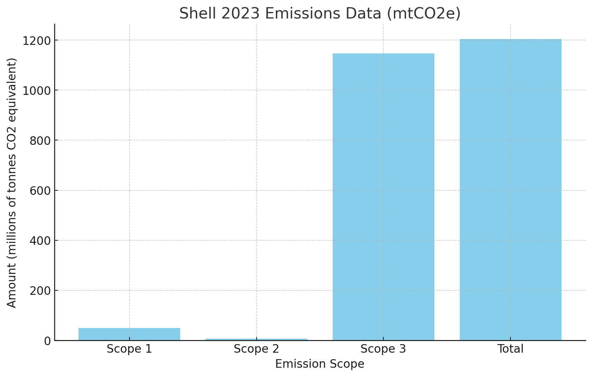
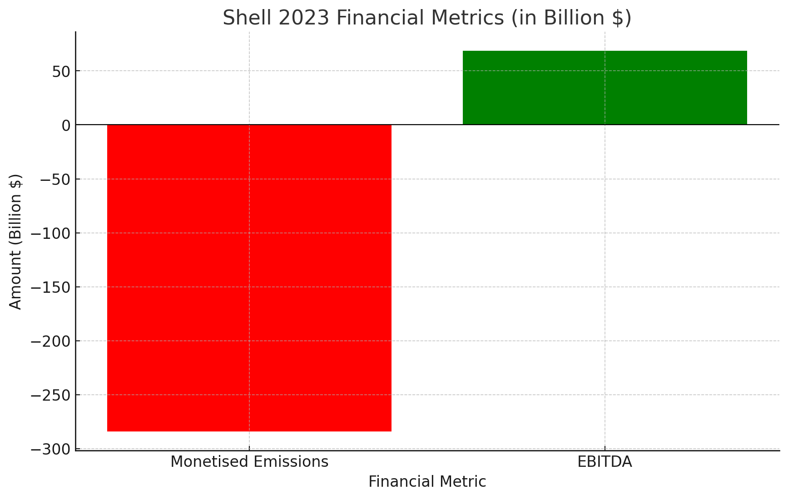

# Shell 2023 Monetised Emissions

Emissions monetised at the International Foundation for Valuing Impact (IFVI) rate of $236/metric tonne (see: Global Value Factor Database, October 2024).

---

## Emissions Data Table

| Emission Scope | Amount (mtCO2e) |
|----------------|------------------|
| Scope 1        | 50               |
| Scope 2        | 7                |
| Scope 3        | 1,147            |
| **Total**      | **1,204**        |

Values expressed as millions of tonnes per carbon dioxide equivalent.

---

## Financial Metrics Table

| Metric                        | Amount (BN)    |
|-------------------------------|-----------------|
| Monetised Emissions           | 284.14          |
| EBITDA                        | 68.54           |
| Monetised Emissions/EBITDA    | 4.15            |

---

# Sources

 | **Category**            | **Source**                                                                                                                   | **Page/Link**                                                                                 |
|-------------------------|-------------------------------------------------------------------------------------------------------------------------------|-----------------------------------------------------------------------------------------------|
| Scope 1 emissions        | [Shell 2023 Sustainability Report](https://reports.shell.com/sustainability-report/2023/_assets/downloads/opd-our-performance-data-shell-sr23.pdf) | p10                                                                                           |
| Scope 2 emissions        | [Shell 2023 Sustainability Report](https://reports.shell.com/sustainability-report/2023/_assets/downloads/opd-our-performance-data-shell-sr23.pdf) | p11 (market-based method)                                                                     |
| Scope 3 emissions        | [Shell: Scope 3 and net carbon intensity, 2023 report](https://reports.shell.com/annual-report/2023/strategic-report/our-journey-to-net-zero/climate-related-metrics-and-targets/scope-3-and-net-carbon-intensity.html) | Link                                                                                          |
| EBITDA                   | [Shell Annual Report 2023](https://reports.shell.com/annual-report/2023/strategic-report/generating-shareholder-value/group-results.html)          | Link                                                                                          |